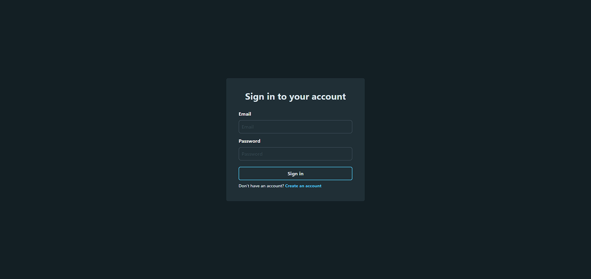

# Language Learning App

This app built with react.js, express.js and mongoDB. Reduxjs/toolkit used for state management  
TailwindCSS used for styling.

## Features

-   Authentication and authorization with JWT
-   Take Quizzes
-   View the mistakes
-   View the leaderboard, shop and profile pages
  
## İmages

### Login Page

### Register Page

### Sections Page

### Lessons Page

### Add Lessons

### Shop Page

### Profile Page

### Leaderboard Page

### Guide Page

### Question Type -1

### Question Type -2

### Question Type -3

